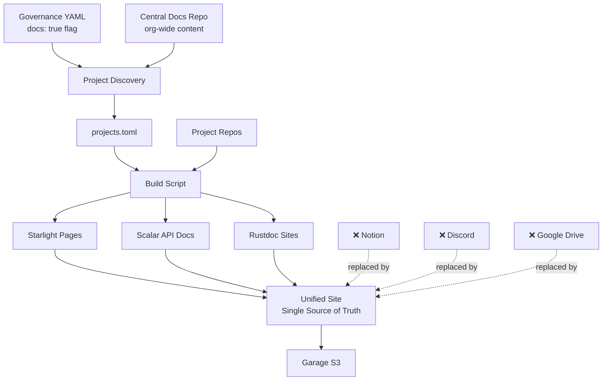

# ScottyLabs Documentation Hub

**The single source of truth for all ScottyLabs documentation.**

Replaces Notion, Discord pins, Google Drive docs, and scattered README files with a unified, searchable, automatically-updated documentation platform. Integrates with ScottyLabs governance to automatically pull documentation from projects marked with the `docs` flag.

## Vision

Every ScottyLabs project, guide, process, and resource in one place:
- **Project Documentation**: Automatically aggregated from repos with `docs: true` in governance
- **Org-Level Documentation**: Central repository for organization-wide guides, processes, and resources
- **API References**: Interactive documentation for all APIs (OpenAPI/Scalar)
- **Code Documentation**: Auto-generated rustdoc for Rust projects
- **Institutional Knowledge**: Onboarding, meeting notes, decision records - everything previously scattered across Notion/Discord

## Features

- **Governance integration**: Projects marked with `docs: true` flag are automatically included
- **Multi-repo aggregation**: Clone and merge documentation from all flagged projects
- **Central org docs**: Dedicated repository for ScottyLabs-wide documentation
- **OpenAPI support**: Interactive API documentation with Scalar
- **Rustdoc integration**: Automatic rustdoc generation and hosting
- **Full-text search**: Find anything across all projects (powered by Pagefind)
- **AI agent access**: Pages serve Markdown via `Accept: text/markdown` ([Accept Markdown](https://acceptmarkdown.com/))
- **CI/CD ready**: Rebuilds automatically when any project updates docs
- **Nix-powered**: Reproducible builds and deployment via Nix flake

## AI / LLM access

The docs site supports [Accept Markdown](https://acceptmarkdown.com/) content negotiation. AI agents can read any page as clean Markdown from the same URL browsers use for HTML:

```bash
curl -sI -H "Accept: text/markdown" https://docs.scottylabs.org/scottylabs/contributing/
# Content-Type: text/markdown; charset=utf-8
# Vary: Accept

curl -s -H "Accept: text/markdown" https://docs.scottylabs.org/scottylabs/contributing/
```

At build time, the site exports a Markdown counterpart for every HTML page. Caddy on infra-01 negotiates `Accept: text/markdown` at the edge and serves the matching `.md` file from Garage.

## Architecture



### Content Sources

1. **Central Org Docs** (`scottylabs-docs` repo)
   - Onboarding guides
   - Organization processes and policies  
   - Meeting notes and decision records
   - Event planning guides
   - Infrastructure documentation

2. **Project Docs** (from repos with `docs: true` in governance)
   - **Starlight** - Markdown documentation that integrates into main navigation
   - **Rust** - Runs `cargo doc`, hosts at `/{slug}/api/`
   - **OpenAPI** - Generates Scalar-rendered interactive API reference

## Automatic Updates

The documentation hub automatically rebuilds when governance changes. See [`GOVERNANCE_INTEGRATION.md`](GOVERNANCE_INTEGRATION.md) for setup instructions.

**What triggers a rebuild:**
- Changes to `data/` in the governance repository
- Direct pushes to this repository
- Manual workflow dispatch

**Setup required in governance repository:**
1. Add access token secret: `DOCS_TRIGGER_TOKEN`
2. Add workflow file: `.forgejo/workflows/trigger-docs-rebuild.yml` (see [`governance-workflow-example.yml`](governance-workflow-example.yml))

Once configured, any change to governance (adding/removing `docs = true` flags, updating descriptions, etc.) will automatically trigger a documentation rebuild and deployment.

## Quick Start

### Prerequisites

- [Bun](https://bun.sh) v1.0+
- [Nix](https://nixos.org) (optional, for reproducible builds)
- Git

### Installation

```bash
# Clone the repository
git clone https://codeberg.org/scottylabs/documentation.git
cd documentation

# Install dependencies
bun install

# Enter development shell (Nix users)
nix develop
```

### Governance Integration

Projects are automatically discovered from the [ScottyLabs governance repository](https://codeberg.org/ScottyLabs/governance). When a repository has `docs = true` in its governance entry (same pattern as `kennel` and `sentry` flags), it's included in the documentation hub.

**To add your project's documentation:**

1. In the governance repository (`data/` directory), add `docs = true` to your repository entry:
   ```toml
   # data/my-team.toml
   [[team.projects]]
   name = "My Project"
   slug = "my-project"
   
   [[team.projects.repos]]
   name = "my-project-backend"
   description = "Backend for My Project"
   kennel = true
   docs = true  # <-- Add this flag (same level as kennel/sentry)
   ```

2. Ensure your repository has a `docs/` directory with markdown files

3. The documentation hub will automatically pick it up on the next build

**Optional configuration:**
```toml
[[team.projects.repos]]
name = "my-api"
docs = true
docs_type = "openapi"  # or "rust" or "starlight" (default)
docs_dir = "documentation"  # custom docs directory
openapi_spec = "openapi.json"  # for OpenAPI projects
export_command = "cargo run --bin export-openapi"
```

**Manual override:** You can also manually add projects to `projects.toml`:

```toml
[[project]]
slug = "my-project"
name = "My Project"
repo = "https://codeberg.org/scottylabs/my-project"
type = "starlight"
docs_dir = "docs"
description = "Documentation for My Project"
```

#### Starlight Project Example

```toml
[[project]]
slug = "guides"
name = "User Guides"
repo = "https://codeberg.org/scottylabs/guides"
type = "starlight"
docs_dir = "docs"
description = "Comprehensive guides for all ScottyLabs services"
```

#### Rust Project Example

```toml
[[project]]
slug = "common-lib"
name = "Common Library"
repo = "https://codeberg.org/scottylabs/common-lib"
type = "rust"
docs_dir = "docs"
description = "Shared Rust utilities and types"
```

#### OpenAPI Project Example

```toml
[[project]]
slug = "courses-api"
name = "Courses API"
repo = "https://codeberg.org/scottylabs/courses-backend"
type = "openapi"
docs_dir = "docs"
openapi_spec = "openapi.json"
export_command = "cargo run --bin export-openapi"
description = "Course scheduling and registration API"
```

### Development

```bash
# Build documentation from all projects
bun run build

# Start development server
bun run dev

# Clean build artifacts
bun run scripts/build.ts clean
```

## Build Pipeline

The build process follows these steps:

1. **Parse manifest** - Read `projects.toml` to get project list
2. **Clone repos** - Parallel `git clone` into `.repos/{slug}/`
3. **Process by type**:
   - **Starlight**: Copy markdown to `src/content/docs/{slug}/`
   - **Rust**: Run `cargo doc`, copy to `public/{slug}/api/`
   - **OpenAPI**: Export spec, generate Scalar page
4. **Generate nav** - Build dynamic Starlight sidebar
5. **Build site** - Run `astro build`

## Project Structure

```
documentation/
├── astro.config.mjs       # Starlight configuration
├── package.json           # Dependencies
├── projects.toml          # Project manifest
├── flake.nix              # Nix development environment
├── .forgejo/
│   └── workflows/
│       └── deploy.yml     # CI/CD pipeline
├── scripts/
│   ├── build.ts           # Main build orchestrator
│   ├── manifest.ts        # TOML parsing
│   ├── clone-repos.ts     # Git operations
│   ├── aggregate-docs.ts  # Content aggregation
│   ├── scalar-integration.ts  # OpenAPI handling
│   ├── rustdoc.ts         # Rust documentation
│   └── generate-nav.ts    # Navigation generation
├── src/
│   ├── content/
│   │   ├── config.ts      # Content collections
│   │   └── docs/          # Documentation pages
│   ├── pages/
│   │   └── [slug]/
│   │       └── api.astro  # Dynamic API pages
│   └── styles/
│       └── scalar-theme.css
└── .repos/                # Cloned repos (gitignored)
```

## CI/CD

### Automated Builds

The documentation hub rebuilds automatically on:
1. **Direct commits** to the documentation repository
2. **Governance changes** via repository dispatch (when governance `data/` changes)
3. **Manual triggers** via workflow dispatch

### Governance Integration

To enable automatic rebuilds when governance changes, add the trigger workflow to the governance repository. See [`GOVERNANCE_INTEGRATION.md`](GOVERNANCE_INTEGRATION.md) for complete setup instructions.

**Quick setup:**
```bash
# In governance repository
mkdir -p .forgejo/workflows
cp /path/to/documentation/governance-workflow-example.yml \
   .forgejo/workflows/trigger-docs-rebuild.yml

# Add secret DOCS_TRIGGER_TOKEN to governance repo
# (see GOVERNANCE_INTEGRATION.md for details)
```

### Forgejo Actions

The included workflow automatically:
1. Checks out the repository
2. Installs dependencies with Bun
3. Runs the build script
4. Uploads artifacts
5. Deploys to Garage S3 (on main branch)

### Required Secrets

Configure these in your Forgejo repository settings:

- `GARAGE_ENDPOINT` - S3 endpoint URL
- `GARAGE_ACCESS_KEY` - S3 access key
- `GARAGE_SECRET_KEY` - S3 secret key

The bucket name is configured in the workflow: `scottylabs-docs`

### Manual Deployment

```bash
# Using Nix
nix run .#upload-garage

# Or directly with environment variables
export GARAGE_ENDPOINT="https://s3.example.com"
export GARAGE_ACCESS_KEY="your-access-key"
export GARAGE_SECRET_KEY="your-secret-key"
export GARAGE_BUCKET="scottylabs-docs"
nix run .#upload-garage
```

## Project Guidelines

### Documentation Structure

For projects contributing Starlight documentation:

```
your-project/
└── docs/
    ├── index.md           # Landing page
    ├── getting-started.md
    ├── guides/
    │   ├── installation.md
    │   └── configuration.md
    └── api/
        └── reference.md
```

### Frontmatter

Standard Starlight frontmatter is supported:

```markdown
---
title: Page Title
description: Page description for SEO
---

# Page Title

Content here...
```

The build system automatically adds:
- `project`: The project slug
- `projectType`: The project type (starlight/rust/openapi)

### OpenAPI Export

For OpenAPI projects, ensure your export command:
1. Runs without starting a server
2. Writes to the path specified in `openapi_spec`
3. Generates valid OpenAPI 3.0+ JSON

Example Rust implementation with `utoipa`:

```rust
// bin/export-openapi.rs
use utoipa::OpenApi;
use std::fs;

#[tokio::main]
async fn main() {
    let doc = ApiDoc::openapi();
    fs::write(
        "openapi.json",
        serde_json::to_string_pretty(&doc).unwrap()
    ).unwrap();
}
```

## Why This Approach?

### Replacing Scattered Documentation

**Before:**
- **Notion**: Onboarding guides, meeting notes, processes (hard to search, requires account)
- **Discord**: Pinned messages, FAQs (ephemeral, poor discoverability)  
- **Google Drive**: Shared docs (siloed, inconsistent permissions)
- **README files**: Scattered across 30+ repos (no central search)
- **Tribal knowledge**: In people's heads or DMs

**After:**
- **One URL**: `docs.scottylabs.org`
- **Full-text search**: Find anything across all projects
- **Always up-to-date**: Rebuilds on every commit
- **No account needed**: Public, accessible, linkable
- **Git-based**: Version controlled, reviewable, forkable

### Governance Integration

Projects use a simple `docs: true` flag (same pattern as `kennel: true`):
- **Automatic discovery**: No manual manifest maintenance
- **Consistent with existing workflows**: Same governance system
- **Self-service**: Project maintainers control their own docs
- **Audit trail**: Changes tracked in governance repo

### Why custom aggregation vs a plugin?

No mature multi-repo plugin exists for Starlight (unlike `mkdocs-monorepo-plugin`). A ~200 LOC build script provides:
- Full control over navigation structure
- Integration with governance system
- Better build caching
- Type-safe TypeScript implementation
- Equivalent UX to established plugins

### Why sibling rustdoc vs embedded?

Rustdoc generates a complete static site with its own theme, search, and navigation. Embedding would require:
- Fragile iframe hacks
- JSON-to-markdown conversion (lossy)
- Custom theming to match (high maintenance)

The sibling pattern (`/{slug}/api/`) is the industry standard (docs.rs, tokio.rs, axum.rs, etc.)

### Why Scalar vs alternatives?

Compared to Swagger UI and Redoc:
- **Better UX**: Modern design, fast rendering
- **More features**: Try It, code generation, dark mode
- **Better integration**: First-party Astro component
- **Active development**: 14K+ stars, regular releases

## Troubleshooting

### Build fails with "Project missing required field"

Check that all required fields are present in `projects.toml`:
- `slug`, `name`, `repo`, `type`, `docs_dir`, `description`

For OpenAPI projects, also ensure:
- `openapi_spec` is set
- `export_command` is provided (if spec isn't pre-generated)

### Rustdoc not appearing

Ensure:
1. Project `type` is set to `"rust"`
2. Repository contains a valid Cargo workspace/package
3. `cargo doc` runs successfully in the project

Check build logs for cargo errors.

### Navigation not updating

The navigation is regenerated on each build. If changes aren't appearing:
1. Clean build artifacts: `bun run scripts/build.ts clean`
2. Rebuild: `bun run build`
3. Check that markdown files have correct file extensions (`.md` or `.mdx`)

## Contributing

### Adding Your Project

1. Fork this repository
2. Add your project to `projects.toml`
3. Ensure your project has documentation in the specified `docs_dir`
4. Test locally: `bun run build && bun run dev`
5. Submit a pull request

### Improving the Hub

Contributions to the documentation hub itself are welcome:
- Build script improvements
- Theme enhancements
- Additional project type support
- Documentation improvements

## License

MIT License - see LICENSE file for details

## Support

For questions or issues:
- Open an issue on Codeberg
- Ask in the ScottyLabs Discord
- Email: tech@scottylabs.org
