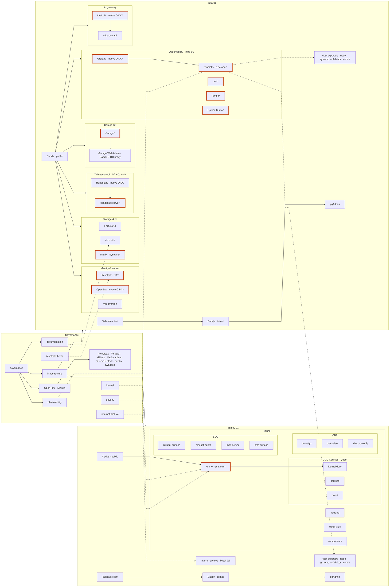

ScottyLabs platform overview. **Click any repo node** to open it on Codeberg. Scroll horizontally if needed, or use the diagram fullscreen button to zoom.

The platform diagram reads left to right: **governance**, then each **NixOS host**. On every host, **Tailscale** (Headscale client) and **host exporters** run alongside **Caddy**. Public web traffic hits **Caddy first**; tailnet-only services like pgAdmin use **Headscale → Caddy → app** (the reverse order from the [Caddy OIDC proxy](#caddy-oidc-proxy) pattern). Services marked **\*** export Prometheus metrics scraped by the Prometheus server on infra-01. Cross-host links are described in prose below the diagram.

Sources: [governance](https://codeberg.org/ScottyLabs/governance) team data, [infrastructure](https://codeberg.org/ScottyLabs/infrastructure) NixOS hosts, and this monorepo checkout.

## Platform



**Diagram key:** orange border or `*` = Prometheus service metrics. **Host exporters** (node, systemd, cAdvisor, comin) run on every NixOS host; the **Prometheus scraper** on infra-01 collects them along with service metrics.

**Tailscale on every host:** each VM runs a Tailscale client registered with the Headscale server on infra-01. **Headplane** (admin UI) runs only on infra-01. **pgAdmin** is tailnet-only (`:5050` on `tailscale0`); reach it via **Headscale → Caddy → pgAdmin**, not from the public internet.

Forgejo CI on infra-01 sends deploy webhooks to kennel on deploy-01. Kennel registers app routes on deploy-01 Caddy via the admin API. **Keycloak** is the org IdP; see [Authentication](#authentication).

## Authentication

Keycloak (`idp.scottylabs.org`) is the org IdP. Caddy always terminates TLS and reverse-proxies, but **where the OIDC login happens** differs:

### Caddy OIDC proxy

For apps that need auth but **do not implement OIDC themselves**, Caddy's [caddy-security](https://github.com/greenpau/caddy-security) plugin handles the full login dance: redirect to Keycloak, establish a session, then proxy to the backend.

```text
Browser → Caddy (OIDC gate) ⇄ Keycloak → Caddy → app
```

Example: **Garage WebAdmin** (`garage.scottylabs.org`) — static UI with no OIDC support; Caddy `authenticate` / `authorize` routes gate `/auth/*` and `/api/*` before reaching Garage's admin API and the WebAdmin bundle.

### Native OIDC

For apps that **speak OIDC themselves**, Caddy is a plain reverse proxy on the public web path. The browser talks to the app; the app redirects to Keycloak and completes the OAuth flow on its own.

```text
Browser → Caddy → app ⇄ Keycloak
```

Examples on infra-01:

| Service | Caddy route | App-side auth |
| ------- | ----------- | ------------- |
| OpenBao | `secrets2.scottylabs.org` → `:8200` | JWT auth backend + Keycloak (via OpenTofu `tofu/identity`) |
| Headscale server | `headscale.scottylabs.org` → Headscale API | OIDC in Headscale (`client_id: headscale`) |
| Headplane | `headplane.scottylabs.org` → Headplane UI | OIDC in Headplane (`client_id: headplane`); admin UI for Headscale |
| Grafana | `grafana.scottylabs.org` → Grafana | `generic_oauth` to Keycloak |
| LiteLLM | `litellm.scottylabs.org` → LiteLLM | Generic OIDC SSO (`GENERIC_*` env) |

### Tailnet-first (Headscale before Caddy)

Some services are not on the public internet. Every NixOS host runs a **Tailscale client** joined to the org Headscale server (infra-01 only). For tailnet-only admin tools, you connect over Headscale **first**, then Caddy, then the app — the opposite order from the Caddy OIDC proxy pattern:

```text
Admin → Headscale (Tailscale) → Caddy → pgAdmin
```

**pgAdmin** listens on `:5050` on the `tailscale0` interface on hosts with PostgreSQL (infra-01, deploy-01). Public Caddy routes do not expose it.

## Application repos

Kennel builds and deploys repos marked `kennel = true` in governance. Those deployments live inside the **kennel** node on deploy-01 in the platform diagram above.

## Prometheus exporters

Grafana on infra-01 queries the **Prometheus scraper** there. Metrics come from two layers:

1. **Host exporters** on every NixOS host (infra-01, deploy-01, snoopy, bus-sign-display) — node, systemd, cAdvisor, and comin metrics. These appear as **Host exporters** nodes in the platform diagram.
2. **Service metrics** on individual platform services — marked with **\*** or an orange border in the diagram. Scraped by Prometheus on infra-01 (see [`observability.nix`](https://codeberg.org/ScottyLabs/infrastructure/src/branch/main/hosts/infra-01/observability.nix)). Dashboards and alerts live in [observability](https://codeberg.org/ScottyLabs/observability).

### Host exporters (every NixOS host)

| Scrape job | Exporter | Port | Hosts |
| ---------- | -------- | ---- | ----- |
| `node` | [node_exporter](https://github.com/prometheus/node_exporter) | 9100 | infra-01, deploy-01, snoopy, bus-sign-display |
| `systemd` | [systemd_exporter](https://github.com/prometheus-community/systemd_exporter) | 9558 | infra-01, deploy-01, snoopy, bus-sign-display |
| `cadvisor` | [cAdvisor](https://github.com/google/cadvisor) | 4194 | infra-01, deploy-01, snoopy |
| `comin` | comin built-in metrics | 4243 | infra-01, deploy-01, snoopy, bus-sign-display |

`systemd_exporter` whitelists: kennel, caddy, postgresql, valkey, garage, loki, tempo, grafana, prometheus, opentelemetry-collector, promtail.

### Service metrics (infra-01 unless noted)

| Scrape job | Service | Metrics source | Grafana dashboard |
| ---------- | ------- | -------------- | ----------------- |
| `prometheus` | Prometheus scraper | self-scrape `:9090` | — |
| `grafana` | Grafana | native `:3000` | — |
| `loki` | Loki | native `:3101/metrics` | — |
| `tempo` | Tempo | native `:3200` | — |
| `otel-collector` | OpenTelemetry Collector | native `:8888` | — |
| `keycloak` | Keycloak | native `:9092` | infra/keycloak |
| `keycloak-events` | Keycloak | realm metrics `:8080/realms/master/metrics` | infra/keycloak |
| `openbao` | OpenBao | `:8200/v1/sys/metrics` | infra/openbao |
| `garage` | Garage | native `:3903` | infra/garage |
| `headscale` | Headscale server | native `:9091` | infra/headscale |
| `postgres` | PostgreSQL | [postgres_exporter](https://github.com/prometheus-community/postgres_exporter) `:9187` | infra/postgres |
| `caddy` | Caddy | admin API `:2019` | infra/caddy |
| `synapse` | Synapse (Matrix) | `/_synapse/metrics` `:9008` | infra/synapse |
| `litellm` | LiteLLM | prometheus-client `/metrics` `:4000` | infra/litellm |
| `atlantis` | Atlantis | `/metrics` `:4141` | infra/atlantis |
| `uptime-kuma` | Uptime Kuma | `/metrics` `:3001` (API key auth) | — |
| `kennel` | Kennel | native `:3001` | kennel/overview (deploy-01) |

Garage WebAdmin uses the **Caddy OIDC proxy** pattern; Garage S3 API (`s3.scottylabs.org`) has no OIDC gate. LiteLLM fronts **cli-proxy-api** on localhost (no scrape job yet). `infra/service-health` aggregates systemd and node metrics across hosts.

## Layers

| Layer | Role | Primary repos |
| ----- | ---- | ------------- |
| Governance | Teams, repos, identities, and OpenTofu for Forgejo/GitHub/Keycloak/Discord/Slack | [governance](https://codeberg.org/ScottyLabs/governance) |
| Infrastructure | Declarative NixOS on campus VMs; comin auto-deploys from Codeberg | [infrastructure](https://codeberg.org/ScottyLabs/infrastructure) |
| Platform | Shared identity, secrets, storage, CI, chat bridges, observability | [observability](https://codeberg.org/ScottyLabs/observability), [keycloak-theme](https://codeberg.org/ScottyLabs/keycloak-theme) |
| Deploy | Branch-based preview and production deploys via Nix builds | [kennel](https://codeberg.org/ScottyLabs/kennel), [devenv](https://codeberg.org/ScottyLabs/devenv) |
| Applications | Product repos deployed through Kennel when `kennel = true` in governance | See team pages under [Projects](/scottylabs/organization/projects/) |

## Hosts

| Host | Purpose |
| ---- | ------- |
| **infra-01** | Tailscale client; **Caddy** → public platform services; Headscale server + Headplane; **Headscale → Caddy → pgAdmin** (tailnet); Prometheus scraper + Grafana/Loki/Tempo |
| **deploy-01** | Tailscale client; **Caddy → kennel** → Kennel deployments; **Headscale → Caddy → pgAdmin** (tailnet); internet-archive batch job |
| **snoopy** | Tailscale client + host exporters (scraped by Prometheus on infra-01) |
| **bus-sign-display** | On-prem display for the [bus-sign](https://codeberg.org/ScottyLabs/bus-sign) project |

## Teams and repos

Registered in governance under `data/teams/`:

| Team | Repos |
| ---- | ----- |
| DevOps | infrastructure, governance, kennel, devenv, observability, documentation |
| CMU Courses | courses, internet-archive |
| CMU Housing | housing |
| Tartan Vote | tartan-vote |
| Quest | quest |
| SLAI | cmugpt-surface, cmugpt-agent, mcp-server, sms-surface |
| CBP | bus-sign, dalmatian, discord-verify, groupme-mirror |
| UI Architecture | components |
