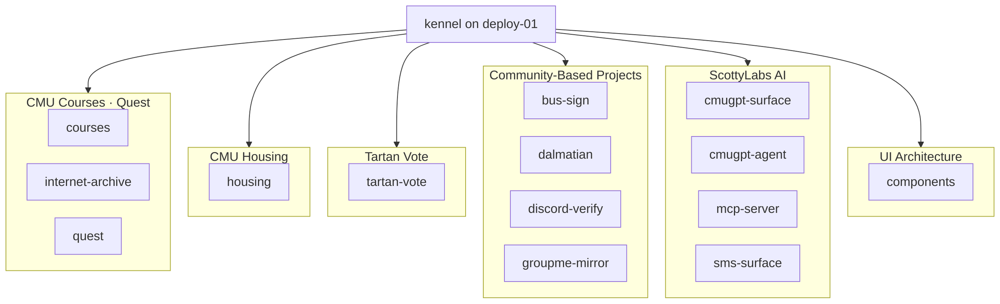

ScottyLabs platform overview. **Click any repo node** to open it on Codeberg. Scroll horizontally if needed, or use the diagram fullscreen button to zoom.

Sources: [governance](https://codeberg.org/ScottyLabs/governance) team data, [infrastructure](https://codeberg.org/ScottyLabs/infrastructure) NixOS hosts, and this monorepo checkout.

## Platform

```mermaid
%%{init: {"flowchart": {"useMaxWidth": false, "nodeSpacing": 28, "rankSpacing": 40, "padding": 12}, "themeVariables": {"fontSize": "17px"}}}%%
flowchart TB
  subgraph gov ["Governance & provisioning"]
    direction LR
    gov_repo["governance"]
    gov_repo --> tofu["OpenTofu · Atlantis"]
    tofu --> idp_sync["Keycloak · Forgejo · GitHub"]
    tofu --> comm_sync["Discord · Slack · Sentry"]
  end

  infra_repo["infrastructure"]
  kennel_repo["kennel"]
  devenv_repo["devenv"]
  observability_repo["observability"]
  documentation_repo["documentation"]
  keycloak_theme["keycloak-theme"]
  terrier["terrier"]
  internet_archive["internet-archive"]

  gov_repo --> infra_repo

  subgraph nix_hosts ["NixOS hosts"]
    direction LR
    infra01["infra-01"]
    deploy01["deploy-01"]
    snoopy["snoopy"]
    bus_display["bus-sign-display"]
  end

  infra_repo --> nix_hosts

  subgraph infra01_svc ["infra-01 services"]
    direction TB
    subgraph id_svc ["Identity & access"]
      direction LR
      keycloak["Keycloak"]
      openbao["OpenBao"]
      vaultwarden["Vaultwarden"]
      headscale["Headscale"]
    end
    subgraph plat_svc ["Storage & CI"]
      direction LR
      garage["Garage S3"]
      forgejo_ci["Forgejo CI"]
      docs_host["docs site"]
      matrix["Matrix"]
    end
    subgraph obs_svc ["Observability"]
      direction LR
      grafana["Grafana · Loki · Tempo"]
      litellm["LiteLLM"]
      uptime["Uptime Kuma"]
    end
  end

  subgraph deploy01_svc ["deploy-01"]
    direction LR
    kennel["kennel service"]
    caddy["Caddy"]
    ia_svc["internet-archive"]
  end

  infra01 --> infra01_svc
  deploy01 --> deploy01_svc

  observability_repo -.-> grafana
  keycloak_theme -.-> keycloak
  documentation_repo -.-> docs_host
  internet_archive -.-> ia_svc
  devenv_repo -.-> kennel
  kennel_repo -.-> kennel
  forgejo_ci -->|"webhook"| kennel

  click gov_repo "https://codeberg.org/ScottyLabs/governance" "governance"
  click infra_repo "https://codeberg.org/ScottyLabs/infrastructure" "infrastructure"
  click kennel_repo "https://codeberg.org/ScottyLabs/kennel" "kennel"
  click devenv_repo "https://codeberg.org/ScottyLabs/devenv" "devenv"
  click observability_repo "https://codeberg.org/ScottyLabs/observability" "observability"
  click documentation_repo "https://codeberg.org/ScottyLabs/documentation" "documentation"
  click keycloak_theme "https://codeberg.org/ScottyLabs/keycloak-theme" "keycloak-theme"
  click terrier "https://codeberg.org/ScottyLabs/terrier" "terrier"
  click internet_archive "https://codeberg.org/ScottyLabs/internet-archive" "internet-archive"
```

## Application repos

Kennel builds and deploys repos marked `kennel = true` in governance.

## Layers

| Layer | Role | Primary repos |
| ----- | ---- | ------------- |
| Governance | Teams, repos, identities, and OpenTofu for Forgejo/GitHub/Keycloak/Discord/Slack | [governance](https://codeberg.org/ScottyLabs/governance) |
| Infrastructure | Declarative NixOS on campus VMs; comin auto-deploys from Codeberg | [infrastructure](https://codeberg.org/ScottyLabs/infrastructure) |
| Platform | Shared identity, secrets, storage, CI, chat bridges, observability | [observability](https://codeberg.org/ScottyLabs/observability), [keycloak-theme](https://codeberg.org/ScottyLabs/keycloak-theme) |
| Deploy | Branch-based preview and production deploys via Nix builds | [kennel](https://codeberg.org/ScottyLabs/kennel), [devenv](https://codeberg.org/ScottyLabs/devenv) |
| Applications | Product repos deployed through Kennel when `kennel = true` in governance | See team pages under [Projects](/scottylabs/organization/projects/) |

## Hosts

| Host | Purpose |
| ---- | ------- |
| **infra-01** | Identity (Keycloak), secrets (OpenBao), object storage (Garage), Forgejo CI runner, Matrix, Grafana stack, Vaultwarden, Headscale, LiteLLM, documentation site |
| **deploy-01** | Kennel deployment platform and Caddy routing for `*.scottylabs.org` / preview domains |
| **snoopy** | Auxiliary campus host (monitored via observability stack) |
| **bus-sign-display** | On-prem display for the [bus-sign](https://codeberg.org/ScottyLabs/bus-sign) project |

## Teams and repos

Registered in governance under `data/teams/`:

| Team | Repos |
| ---- | ----- |
| DevOps | infrastructure, governance, kennel, devenv, observability, documentation |
| CMU Courses | courses, internet-archive |
| CMU Housing | housing |
| Tartan Vote | tartan-vote |
| Quest | quest |
| ScottyLabs AI | cmugpt-surface, cmugpt-agent, mcp-server, sms-surface |
| Community-Based Projects | bus-sign, dalmatian, discord-verify, groupme-mirror |
| UI Architecture | components |
