ScottyLabs platform overview. **Click any repo node** to open it on Codeberg. Scroll horizontally if needed, or use the diagram fullscreen button to zoom.

The platform diagram reads left to right: **repos & governance**, then **infra-01** and **deploy-01**. Each host is top-down: **Caddy → service → nested components** (for example **Caddy → kennel →** deployed repos on deploy-01). Cross-host links (Forgejo webhooks, Kennel Caddy admin API) are described in prose below the diagram. **Keycloak** is the org IdP; see [Authentication](#authentication) for how Caddy OIDC proxy vs native OIDC differ.

Sources: [governance](https://codeberg.org/ScottyLabs/governance) team data, [infrastructure](https://codeberg.org/ScottyLabs/infrastructure) NixOS hosts, and this monorepo checkout.

## Platform

```mermaid
%%{init: {"flowchart": {"useMaxWidth": false, "curve": "linear", "nodeSpacing": 36, "rankSpacing": 48, "padding": 16}, "themeVariables": {"fontSize": "16px"}}}%%
flowchart LR
  subgraph col_repos ["Governance"]
    direction TB
    gov_repo["governance"]
    gov_repo --> tofu["OpenTofu · Atlantis"]
    tofu --> provisioned["Keycloak · Forgejo · GitHub · Vaultwarden · Discord · Slack · Sentry · Synapse"]
    observability_repo["observability"]
    documentation_repo["documentation"]
    gov_repo --> observability_repo
    gov_repo --> documentation_repo
    infra_repo["infrastructure"]
    gov_repo --> infra_repo
    kennel_repo["kennel"]
    devenv_repo["devenv"]
    keycloak_theme["keycloak-theme"]
    internet_archive["internet-archive"]
  end

  subgraph col_infra01 ["infra-01"]
    direction TB
    caddy_infra["Caddy"]
    subgraph infra_chains ["Services"]
      direction LR
      subgraph chain_id ["Identity & access"]
        direction TB
        keycloak["Keycloak · IdP"]
        openbao["OpenBao · native OIDC"]
        vaultwarden["Vaultwarden"]
        headplane["Headplane · native OIDC"]
        headscale["Headscale · native OIDC"]
        headplane --> headscale
      end
      subgraph chain_plat ["Storage & CI"]
        direction TB
        forgejo_ci["Forgejo CI"]
        docs_host["docs site"]
        matrix["Matrix"]
      end
      subgraph chain_garage ["Garage S3"]
        direction TB
        garage_s3["Garage"]
        garage_webadmin["Garage WebAdmin · Caddy OIDC proxy"]
        garage_s3 --> garage_webadmin
      end
      subgraph chain_obs ["Observability"]
        direction TB
        grafana["Grafana · native OIDC"]
        prometheus["Prometheus"]
        loki["Loki"]
        tempo["Tempo"]
        uptime["Uptime Kuma"]
        grafana --> prometheus
      end
      subgraph chain_ai ["AI gateway"]
        direction TB
        litellm["LiteLLM · native OIDC"]
        cli_proxy["cli-proxy-api"]
        litellm --> cli_proxy
      end
    end
    caddy_infra --> infra_chains
  end

  subgraph col_deploy01 ["deploy-01"]
    direction LR
    subgraph deploy_web [" "]
      direction TB
      caddy_deploy["Caddy"]
        subgraph kennel_apps ["Kennel deployments"]
          direction LR
          subgraph team_courses ["CMU Courses · Quest"]
            direction TB
            kennel_docs["kennel docs"]
            courses["courses"]
            quest["quest"]
          end
          subgraph team_housing ["CMU Housing"]
            direction TB
            housing["housing"]
          end
          subgraph team_vote ["Tartan Vote"]
            direction TB
            tartan_vote["tartan-vote"]
          end
          subgraph team_cbp ["CBP"]
            direction TB
            bus_sign["bus-sign"]
            dalmatian["dalmatian"]
            discord_verify["discord-verify"]
          end
          subgraph team_slai ["SLAI"]
            direction TB
            cmugpt_surface["cmugpt-surface"]
            cmugpt_agent["cmugpt-agent"]
            mcp_server["mcp-server"]
            sms_surface["sms-surface"]
          end
          subgraph team_uia ["UI Architecture"]
            direction TB
            components["components"]
          end
      end
      caddy_deploy --> kennel
    end
    subgraph chain_jobs ["Host jobs"]
      direction TB
      ia_batch["internet-archive · batch job"]
    end
  end

  infra_repo --> col_infra01
  infra_repo --> col_deploy01

  observability_repo -.-> chain_obs
  documentation_repo -.-> docs_host
  keycloak_theme -.-> keycloak
  kennel_repo -.-> kennel
  devenv_repo -.-> kennel
  internet_archive -.-> ia_batch

  click gov_repo "https://codeberg.org/ScottyLabs/governance" "governance"
  click infra_repo "https://codeberg.org/ScottyLabs/infrastructure" "infrastructure"
  click kennel_repo "https://codeberg.org/ScottyLabs/kennel" "kennel"
  click devenv_repo "https://codeberg.org/ScottyLabs/devenv" "devenv"
  click observability_repo "https://codeberg.org/ScottyLabs/observability" "observability"
  click documentation_repo "https://codeberg.org/ScottyLabs/documentation" "documentation"
  click keycloak_theme "https://codeberg.org/ScottyLabs/keycloak-theme" "keycloak-theme"
  click internet_archive "https://codeberg.org/ScottyLabs/internet-archive" "internet-archive"
  click courses "https://codeberg.org/ScottyLabs/courses" "courses"
  click housing "https://codeberg.org/ScottyLabs/housing" "housing"
  click tartan_vote "https://codeberg.org/ScottyLabs/tartan-vote" "tartan-vote"
  click quest "https://codeberg.org/ScottyLabs/quest" "quest"
  click dalmatian "https://codeberg.org/ScottyLabs/dalmatian" "dalmatian"
  click bus_sign "https://codeberg.org/ScottyLabs/bus-sign" "bus-sign"
  click discord_verify "https://codeberg.org/ScottyLabs/discord-verify" "discord-verify"
  click cmugpt_surface "https://codeberg.org/ScottyLabs/cmugpt-surface" "cmugpt-surface"
  click cmugpt_agent "https://codeberg.org/ScottyLabs/cmugpt-agent" "cmugpt-agent"
  click mcp_server "https://codeberg.org/ScottyLabs/mcp-server" "mcp-server"
  click sms_surface "https://codeberg.org/ScottyLabs/sms-surface" "sms-surface"
  click components "https://codeberg.org/ScottyLabs/components" "components"
```



Forgejo CI on infra-01 sends deploy webhooks to kennel on deploy-01. Kennel registers app routes on deploy-01 Caddy via the admin API.

## Authentication

Keycloak (`idp.scottylabs.org`) is the org IdP. Caddy always terminates TLS and reverse-proxies, but **where the OIDC login happens** differs:

### Caddy OIDC proxy

For apps that need auth but **do not implement OIDC themselves**, Caddy's [caddy-security](https://github.com/greenpau/caddy-security) plugin handles the full login dance: redirect to Keycloak, establish a session, then proxy to the backend.

```text
Browser → Caddy (OIDC gate) ⇄ Keycloak → Caddy → app
```

Example: **Garage WebAdmin** (`garage.scottylabs.org`) — static UI with no OIDC support; Caddy `authenticate` / `authorize` routes gate `/auth/*` and `/api/*` before reaching Garage's admin API and the WebAdmin bundle.

### Native OIDC

For apps that **speak OIDC themselves**, Caddy is a plain reverse proxy. The browser talks to the app; the app redirects to Keycloak and completes the OAuth flow on its own.

```text
Browser → Caddy → app ⇄ Keycloak
```

Examples on infra-01:

| Service | Caddy route | App-side auth |
| ------- | ----------- | ------------- |
| OpenBao | `secrets2.scottylabs.org` → `:8200` | JWT auth backend + Keycloak (via OpenTofu `tofu/identity`) |
| Headscale | `headscale.scottylabs.org` → Headscale API | OIDC in Headscale (`client_id: headscale`) |
| Headplane | `headplane.scottylabs.org` → Headplane UI | OIDC in Headplane (`client_id: headplane`); admin UI for Headscale |
| Grafana | `grafana.scottylabs.org` → Grafana | `generic_oauth` to Keycloak |
| LiteLLM | `litellm.scottylabs.org` → LiteLLM | Generic OIDC SSO (`GENERIC_*` env) |

OpenBao, Headscale, and Headplane all use this pattern: **Caddy → app**, with the app redirecting to Keycloak when login is required. None of them are `Caddy → Keycloak → app`.

## Application repos

Kennel builds and deploys repos marked `kennel = true` in governance. Those deployments live inside the **kennel** node on deploy-01 in the platform diagram above.

## Prometheus exporters

Grafana queries **Prometheus** on infra-01. Every service with a Grafana dashboard exposes metrics through one of the scrape jobs below (defined in [`infrastructure/hosts/infra-01/observability.nix`](https://codeberg.org/ScottyLabs/infrastructure/src/branch/main/hosts/infra-01/observability.nix)). Dashboards and alerts live in [observability](https://codeberg.org/ScottyLabs/observability).

### Host agents (all NixOS hosts)

| Scrape job | Exporter | Port | Hosts |
| ---------- | -------- | ---- | ----- |
| `node` | [node_exporter](https://github.com/prometheus/node_exporter) | 9100 | infra-01, deploy-01, snoopy, bus-sign-display |
| `systemd` | [systemd_exporter](https://github.com/prometheus-community/systemd_exporter) | 9558 | infra-01, deploy-01, snoopy, bus-sign-display |
| `cadvisor` | [cAdvisor](https://github.com/google/cadvisor) | 4194 | infra-01, deploy-01, snoopy |
| `comin` | comin built-in metrics | 4243 | infra-01, deploy-01, snoopy, bus-sign-display |

`systemd_exporter` whitelists: kennel, caddy, postgresql, valkey, garage, loki, tempo, grafana, prometheus, opentelemetry-collector, promtail.

### Platform services (infra-01 unless noted)

| Scrape job | Service | Metrics source | Grafana dashboard |
| ---------- | ------- | -------------- | ----------------- |
| `prometheus` | Prometheus | self-scrape `:9090` | — |
| `grafana` | Grafana | native `:3000` | — |
| `loki` | Loki | native `:3101/metrics` | — |
| `tempo` | Tempo | native `:3200` | — |
| `otel-collector` | OpenTelemetry Collector | native `:8888` | — |
| `keycloak` | Keycloak | native `:9092` | infra/keycloak |
| `keycloak-events` | Keycloak | realm metrics `:8080/realms/master/metrics` | infra/keycloak |
| `openbao` | OpenBao | `:8200/v1/sys/metrics` | infra/openbao |
| `garage` | Garage | native `:3903` | infra/garage |
| `headscale` | Headscale | native `:9091` | infra/headscale |
| `postgres` | PostgreSQL | [postgres_exporter](https://github.com/prometheus-community/postgres_exporter) `:9187` | infra/postgres |
| `caddy` | Caddy | admin API `:2019` | infra/caddy |
| `synapse` | Synapse (Matrix) | `/_synapse/metrics` `:9008` | infra/synapse |
| `litellm` | LiteLLM | prometheus-client `/metrics` `:4000` | infra/litellm |
| `atlantis` | Atlantis | `/metrics` `:4141` | infra/atlantis |
| `uptime-kuma` | Uptime Kuma | `/metrics` `:3001` (API key auth) | — |

Garage WebAdmin (`garage.scottylabs.org`) uses the **Caddy OIDC proxy** pattern. Garage S3 API is `s3.scottylabs.org` with no OIDC gate (bucket auth via access keys).

Caddy on **infra-01** terminates TLS and reverse-proxies platform services. On **deploy-01**, traffic flows **Caddy → kennel** for the platform itself; Kennel then deploys apps (including its own docs) and registers their routes on Caddy via the admin API.

LiteLLM (`litellm.scottylabs.org`) is the public proxy; model requests go to **cli-proxy-api** on localhost (no Prometheus scrape job yet).

### Deploy and CI

| Scrape job | Service | Metrics source | Host | Grafana dashboard |
| ---------- | ------- | -------------- | ---- | ----------------- |
| `kennel` | Kennel | native `:3001` | deploy-01 | kennel/overview |
| `postgres` | PostgreSQL | postgres_exporter `:9187` | deploy-01 | infra/postgres |
| `cadvisor` | cAdvisor | `:4194` | deploy-01 | infra/hosts |
| `comin` | comin | `:4243` | deploy-01 | infra/comin |

`infra/service-health` aggregates systemd and node metrics across hosts and services.

## Layers

| Layer | Role | Primary repos |
| ----- | ---- | ------------- |
| Governance | Teams, repos, identities, and OpenTofu for Forgejo/GitHub/Keycloak/Discord/Slack | [governance](https://codeberg.org/ScottyLabs/governance) |
| Infrastructure | Declarative NixOS on campus VMs; comin auto-deploys from Codeberg | [infrastructure](https://codeberg.org/ScottyLabs/infrastructure) |
| Platform | Shared identity, secrets, storage, CI, chat bridges, observability | [observability](https://codeberg.org/ScottyLabs/observability), [keycloak-theme](https://codeberg.org/ScottyLabs/keycloak-theme) |
| Deploy | Branch-based preview and production deploys via Nix builds | [kennel](https://codeberg.org/ScottyLabs/kennel), [devenv](https://codeberg.org/ScottyLabs/devenv) |
| Applications | Product repos deployed through Kennel when `kennel = true` in governance | See team pages under [Projects](/scottylabs/organization/projects/) |

## Hosts

| Host | Purpose |
| ---- | ------- |
| **infra-01** | **Caddy** → Keycloak, OpenBao, Headscale, Headplane, Garage → WebAdmin, Forgejo CI webhooks, Matrix, Grafana stack, Vaultwarden, LiteLLM → cli-proxy-api, documentation site |
| **deploy-01** | **Caddy** → kennel → Kennel deployments (e.g. kennel docs); internet-archive batch job (NixOS, not via Caddy) |
| **snoopy** | Auxiliary campus host (monitored via observability stack) |
| **bus-sign-display** | On-prem display for the [bus-sign](https://codeberg.org/ScottyLabs/bus-sign) project |

## Teams and repos

Registered in governance under `data/teams/`:

| Team | Repos |
| ---- | ----- |
| DevOps | infrastructure, governance, kennel, devenv, observability, documentation |
| CMU Courses | courses, internet-archive |
| CMU Housing | housing |
| Tartan Vote | tartan-vote |
| Quest | quest |
| SLAI | cmugpt-surface, cmugpt-agent, mcp-server, sms-surface |
| CBP | bus-sign, dalmatian, discord-verify, groupme-mirror |
| UI Architecture | components |
